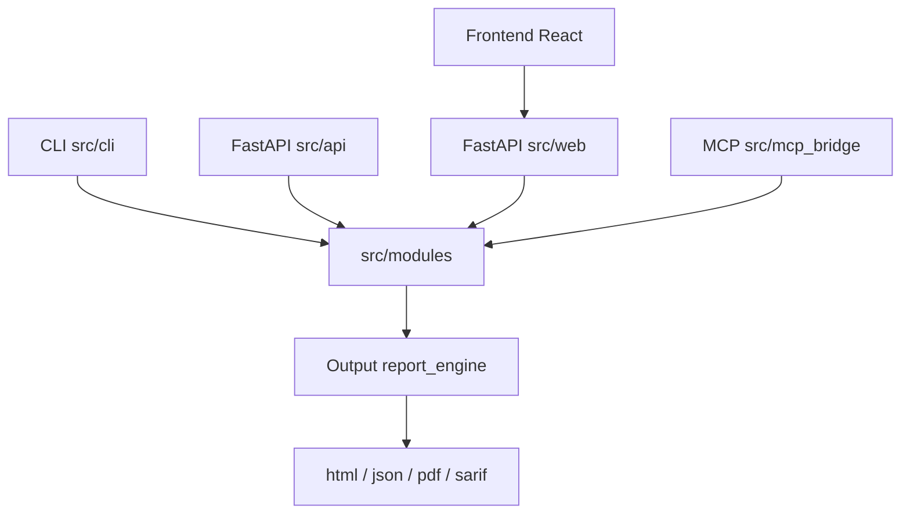

# AGENTS.md — 1ai-osint

## MANDATORY PROCESS (8 Steps — No Skipping)

Every task follows this sequence. No exceptions.

1. **AUDIT** — Read existing code. Understand current state.
2. **THINK** — Understand WHY. Intent vs literal.
3. **BRAINSTORM** — ≥3 approaches. Score options.
4. **PLAN** — Decompose. Risks. Rollback plan.
5. **EXECUTE** — Build. TDD when possible.
6. **TEST** — Run all tests. Break it first.
7. **VERIFY** — Prove with literal output.
8. **REVIEW** — Read your own diff before committing.

Full details: `~/.1ai/core/PROCESS.md` (auto-injected by hooks)

## This repo
AI-powered OSINT & ZKIT research platform — breach aggregation, secret scanning, crypto analysis, identity correlation, and AI orchestration.
Stack: Python
Domain: Security intelligence, OSINT, crypto forensics, identity tracking

## Rules — thin loader, no submodule
Rules are NOT vendored into this repo. This repo does NOT need a rules submodule.
`AGENTS.md` is only the repo-local loader: domain, commands, conventions, and pointers to `~/.1ai`.

Engineering rules are enforced by machine-level loaders when `setup-dev.sh` has been run:
- Claude Code: SessionStart hook injects `~/.1ai/core/RULES.md`
- OpenCode: plugin injects `~/.1ai/core/RULES.md`
- OMP: wrapper appends `~/.1ai/core/RULES.md` to launch sessions

Primary rules file:
```bash
cat ~/.1ai/core/RULES.md
```

Pre-ship gate:
```bash
cat ~/.1ai/core/GATE.md
```

If `~/.1ai` or auto-load is missing, run:
```bash
bash ~/.1ai/scripts/setup-dev.sh
```

Do NOT add the rules repo as a git submodule. Update rules centrally, then run/sync the thin `AGENTS.md` template.

## Hard rules
1. Read code before writing code.
2. No completion claim without literal receipt.
3. Compile/test/use like a real user before claiming work is ready.
4. Task must match this repo domain.
5. Run GATE.md before commit/PR.

## Repo-specific conventions
- All modules use async/await patterns
- Pydantic models for all data shapes — always provide `id` and `scan_id` on Finding/ScanResult
- Mock external APIs in tests, never call real endpoints
- Module registration via `__init__.py` exports
- Rate limiting via `rate_limiter.py` for all external calls
- Caching via `cache.py` to avoid redundant API hits
- Patch source module for locally-imported functions, not calling module
- Always `rm -f .coverage` before full pytest runs (known corruption issue)

## Commands
- Dev:   `uv run python -m app`
- Test:  `make test`
- CI:    `make ci` (lint → typecheck → test)
- Lint:  `make lint`
- Type:  `make typecheck`
- Coverage: `make coverage`

---

## Tech Stack (onboarding)

- **Backend**: Python ≥3.10. Deps utama (pyproject.toml): typer (CLI), pydantic v2 (semua data shapes), httpx (HTTP client), langgraph + openai (AI orchestration), fastapi/uvicorn (API/web), web3 + solana (crypto), telethon (telegram), neo4j (identity graph), `mcp>=1.0,<2.0` (MCP bridge), playwright (browser), reportlab + jinja2 (reporting), sherlock-project + duckduckgo-search (OSINT sources).
- **Frontend**: React 19.2.6, Vite 8.0.12, TypeScript ~6.0.2, lucide-react (frontend/package.json).
- **Build/tooling**: uv / setuptools; entry point `1ai-osint = src.cli.main:app` (pyproject.toml:94). CI: `make ci` (lint → typecheck → test). Pre-commit via `.pre-commit-config.yaml`.

## Arsitektur Singkat

CLI (typer, `src/cli`) dan FastAPI (`src/api`, `src/web`) plus MCP server (`src/mcp_bridge`) semuanya masuk ke modul OSINT di `src/modules/*` — `deep_scan` sebagai orkestrator, `crypto` (balance/leak_finder/passphrase/privatekey), `identity_tracking` (ZKIT), `sources` (keyless + API), dst. Setiap module menurunkan `BaseOSINTTool` dan menghasilkan `Finding`/`ScanResult` Pydantic (wajib `id` + `scan_id`), lalu `report_engine` merender output (json/pdf/sarif/html). Frontend React mem-poll `/api/scan/{job_id}` untuk progress. Rate limit via `rate_limiter.py`, cache via `cache.py`.

## Sub-Direktori

- `src/AGENTS.md` — index package Python (core, ai, api, cli, web, modules, investigations, plugin(s), vendor, mcp_bridge, utils)
- `frontend/AGENTS.md` — SPA React; leaf consumer backend API (polling `/api/scan/{job_id}`)
- `scripts/AGENTS.md` — tooling dev (benchmark, soak, source_baseline, demo)
- `tests/AGENTS.md` — strategi testing (unit/integration/fixtures/benchmarks)
- `notebooks/AGENTS.md` — notebook eksperimen (zkit_analysis, experimental_results)
- `docs/AGENTS.md` — dokumentasi (blueprint, architecture, compliance, dll.)
- `.github/AGENTS.md` — CI workflows (GitHub Actions) — catatan: `workflows/AGENTS.md` stale (2 dari 6 workflow belum ter-dokumentasi)

## Global Constraints

- **Env vars wajib** (lihat `.env.example`): API keys untuk source berbayar, `NEO4J_PASSWORD` (dev fallback `secrets.token_urlsafe(32)` di `src/modules/identity_tracking/_neo4j_helpers.py:22` — wajib set untuk produksi), OpenAI key untuk AI orchestration.
- Semua panggilan eksternal WAJIB lewat `rate_limiter.py`; hasil API WAJIB di-cache via `cache.py`.
- Semua data shapes Pydantic — selalu `id` + `scan_id` pada Finding/ScanResult.
- Secret handling: AGENTS.md mencatat secret hanya dalam bentuk redacted (jenis + file:line + maks 8 karakter akhir).

## Prioritas Improvement (Top 5)

1. [RESOLVED-High] Web UI fail-open ADMIN (auth default allow) + bind `0.0.0.0` — `src/web/auth.py:116` → fail-closed 403; bind default `127.0.0.1` di `src/web/main.py:15` / `src/cli/commands/config_commands.py:122` (override via env `WEB_HOST` / `--host`)
2. [RESOLVED-High] MCP server default `requester_tier="admin"` membuat RBAC gate tak pernah memblokir — `src/mcp_bridge/server.py:147` → default `"readonly"`; caller harus pass `requester_tier="analyst"/"admin"` eksplisit (5 source ADMIN-tier: dehashed, leakcheck, snylla, snusbase, intelx kini tertutup di default)
3. [RESOLVED-High] `tx_tracer.py` memakai placeholder KNOWN_EXCHANGES/KNOWN_MIXERS palsu + `_trace_btc()` self-query → attribution/risk BTC selalu salah — `src/modules/crypto/tx_tracer.py` → output ditandai `attribution_unverified=True` / `attribution_verified=False`, risk_reasoning prefix `UNVERIFIED:`, KNOWN lists diberi label PLACEHOLDER (list placeholder sengaja dipertahankan, tidak ditulis ulang)
4. [RESOLVED-High] PII leak: `output/pdf_export.py:32` menulis raw target unhashed ke PDF legacy — target kini di-hash (`sha256(salt:value)`) sesuai `PDFGenerator._hash_value`; docstring menandai deprecated
5. [RESOLVED-Medium] Frontend polling job tanpa timeout/abort — `frontend/src/App.tsx` → `MAX_POLL_ATTEMPTS=90`, `MAX_CONSECUTIVE_POLL_FAILURES=5`, pesan stuck-job

Catatan: seluruh item di atas sudah diterapkan ke working tree dan diverifikasi (pytest 2643 passed/8 skipped, lint & typecheck clean, frontend build clean). Temuan lain severity Medium/Low yang difix: `src/api/app.py` (job store eviction, PDF export dalam `if req.case_id:`, proyeksi `_job_public()`, rate limit status endpoint, SSRF dedup target), `src/cli` (PeopleFinder `"social"` → SocialOSINTTool, sweep pakai `getpass` no-echo, timeout sentinel, makedirs output, monitor dedup sha1), `src/plugin` (contract hook fires, dispatch_ordered), vendor (leak_telegram event loop 3.10-compatible, chiasmodon error dict saat token hilang, leak_github lazy token, `_neo4j_helpers.py` dev fallback + mypy), `src/web/routes/_loader.py` baru (shared cached JSON loader), `timeline.py:110` event id sha1, `api.py` health tanpa `data_directories`, `report_engine/__init__.py` enum `ReportFormat` mati dihapus, `people_finder/keyless.py` baru (provider keyless 0-API fallback) + `people_finder/search.py`, `phone_finder` (no fabricated findings untuk non-phone), `scripts/live_benchmark.py` (hitung findings dari nested list).

## Excluded Paths

- `node_modules/`, `dist/`, `build/`, `.next/`, `target/` [SKIPPED — vendored/generated]
- `.venv/`, `__pycache__/`, `.mypy_cache/`, `.pytest_cache/`, `.ruff_cache/` [SKIPPED — generated]
- `.git/`, `.github/` (AGENTS.md khusus dibuat untuk `.github/` + `workflows/` saja) [SKIPPED — metadata/VCS]
- `1ai_osint.egg-info/`, `site/` (mkdocs generated), `output/` (artifacts runtime), `state/` (runtime), `_rules/` (bukan source), `*.session` [SKIPPED — generated/runtime]

## Dependency Map



> Last updated: fix pass — 9 area fix diterapkan & diverifikasi (pytest 2643 passed/8 skipped, lint+typecheck clean, frontend build clean); top-5 improvement ditandai RESOLVED, front-matter commit → f73d4f2, catatan NEO4J dev fallback diperbarui
