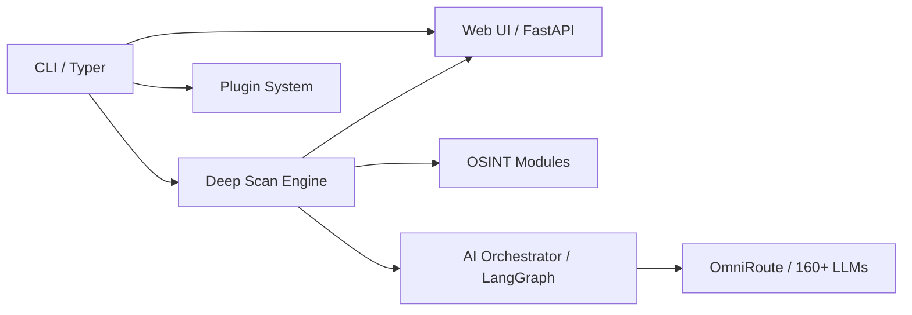

# Architecture

1ai-osint is an **AI-powered OSINT & Zero Knowledge Identity Tracking (ZKIT)
research platform**. This page summarizes the high-level design, tech stack,
and directory layout.

## Layers



1. **CLI layer** (`src/cli/`) — a Typer-based command interface exposing scan,
   deep-scan, crypto, identity, monitoring, and node commands.
2. **Engine layer** (`src/modules/`) — the async deep scan engine with
   multi-phase iterations, per-module dispatch, and scan profiles, plus the
   plugin system (`src/plugin/`).
3. **AI layer** (`src/ai/`) — a LangGraph-based orchestrator that analyzes
   collected intelligence via OmniRoute (160+ LLMs) or a direct OpenAI
   fallback.
4. **Presentation layer** (`src/web/`) — a FastAPI web dashboard with entity
   browser, report viewer, and timeline visualization.

## Tech stack

| Area | Technology |
| --- | --- |
| Language | Python >= 3.10 |
| CLI | Typer |
| Web | FastAPI, uvicorn |
| AI orchestration | LangGraph, openai, langchain-openai |
| Async HTTP | httpx |
| Validation / settings | pydantic, pydantic-settings |
| Crypto forensics | web3, eth-account, solana, solders, bip-utils |
| Telegram / messaging | telethon |
| Username enumeration | sherlock-project |
| PDF generation | reportlab |
| Neo4j | neo4j (graph storage) |

## Entry points

| Entry point | Path |
| --- | --- |
| CLI | `src/cli/main.py` |
| Web API | `src/api/app.py` |
| Web UI (dashboard) | `src/web/main.py` |
| AI orchestrator | `src/ai/orchestrator.py` |

## Directory layout

```text
src/
├── cli/               # Typer commands (scan, deep_scan, web, node, ...)
├── core/              # Configuration (pydantic-settings), logging
├── modules/
│   ├── deep_scan/     # Async multi-phase scan engine, profiles, exports
│   ├── data_leaks/    # 13+ breach/leak source adapters + aggregator
│   ├── people_finder/ # Sherlock-powered username enumeration
│   ├── phone_finder/  # Phone number OSINT
│   ├── crypto/        # Passphrase, private-key, balance (BTC/ETH/SOL/TRON)
│   ├── identity_tracking/  # ZKIT privacy-preserving identity graph
│   ├── social_osint/  # Social media OSINT
│   ├── vuln_scanner/  # Vulnerability scanning modules
│   ├── gitleaks/      # Secret scanning
│   ├── node/          # Distributed node agent / Telegram master
│   └── sources.py     # Source discovery registry
├── ai/                # LangGraph orchestrator
├── web/               # FastAPI dashboard (routes/, static/)
├── plugin/            # Plugin registry, hooks, example plugin
├── vendor/            # Vendored integrations (e.g. chiasmodon providers)
└── investigations/    # Case manager (persists per-case evidence)
```

## Key subsystems

### Deep scan engine

`src/modules/deep_scan/engine.py` runs recursive identity investigations. It
supports three profiles — `fast`, `standard`, `deep` — that control module
selection, iteration counts, and timeouts. Results are exported as HTML,

### Thin agent loop

`src/modules/deep_scan/agent_loop.py` (blueprint Phase 1 S4) adds a
rule-based planner on top of the engine: one target → `detect_target_type()`
picks an ordered source plan (email/phone/username/domain/name/crypto), a
parallel primary wave runs, and rate-limited/errored sources fall back to
alternates. Every step is compliance-gated (consent-required sources are
blocked pre-run) and audited through the same adapter layer. A head-to-head
benchmark (`scripts/benchmark_agent_vs_batch.py`) measures 6.22x wall-clock
speedup over the naive "run everything" batch.

### MCP bridge

`src/mcp_bridge/server.py` (blueprint Phase 1 S3) is a FastMCP server
exposing `search(target, source_filter)` (wraps `run_source_scan` +
`CrossModuleCorrelator.correlate`), `list_sources()` and
`source_compliance()` to any MCP-capable client. Run standalone via
`uv run python -m src.mcp_bridge.server` (stdio). Named `mcp_bridge` (not
`mcp`) so it cannot shadow the official MCP SDK package.
JSON, STIX, or PDF briefings. See [Modules](modules.md) and
[CLI](cli.md).

### Plugin system

`src/plugin/` provides a plugin registry (`PluginRegistry.discover()` scans
`src.plugins` and the `1ai_osint.plugins` entry-point group), a hook
dispatcher, and an example plugin.

### ZKIT

`src/modules/identity_tracking/` implements the Zero Knowledge Identity
Tracking protocol: identity values are hashed with a per-investigation salt
(`ZKIT_SALT`) so identifiers are never stored in plaintext. The protocol is
documented in `docs/ZKIT_PROTOCOL.md`.

### Distributed nodes

`src/modules/node/` implements a Telegram-controlled worker architecture: a
`master` bot dispatches tasks to `node` agents, each exposing an HTTP API.

## See also

- [Modules](modules.md)
- [CLI](cli.md)
- [Web UI](web-ui.md)
- [Configuration](configuration.md)
- [Roadmap](roadmap.md)
